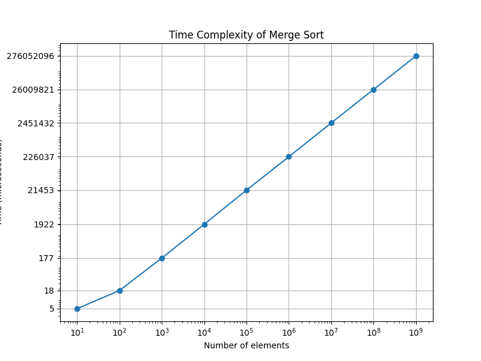

# parallel-programming
This project implements the Merge Sort algorithm in C++ and compares its performance of different array sizes using the Centaurus HPC cluster. The results are plotted using Matplotlib in Python.

## Compile and Run
To compile the mergesort.cpp file, run:\
`make`\
This will generate an executable file named mergesort.

Submit the batch job on a compute node using SLURM with:\
`make run`\
This will execute `sbatch run_mergesort.sh`, which runs the program with different size arrays and saves the output to mergesort_output.csv.

To view the output of the execution, run:\
`make view`\
This will execute `cat mergesort_output.csv`, which shows the output of the program executions.

After running the benchmark, generate a plot using:\
`make plot`\
This will execute `python3 plot.py` to visualize the sorting performance.

To remove compiled files and reset the project, run:\
`make clean`

# SLURM Script (run_mergesort.sh)
This batch script run the program on different input sizes and stores execution times in mergesort_output.csv. The input sizes range from 10 to 109.

# Output Format (mergesort_output.csv)
The benchmarking script outputs data in CSV format with the following header:\
`size,time(microseconds)`

# Plot Output (plot.py)
The plot generated using plot.py shows execution time vs. array size.

# Analysis of Benchmark Results
The benchmarking results show that as the array size grows, the sorting time also increases:
### CSV File Results
|Size|Time (microseconds)|
|----|----|
|10|5|
|100|18|
|1000|177|
|10000|1922|
|100000|21453|
|1000000|226037|
|10000000|2451432|
|100000000|26009821|
|1000000000|276052096|

The times are reasonable and make sense as the output follows the O(n log n) time complexity of merge sort.
